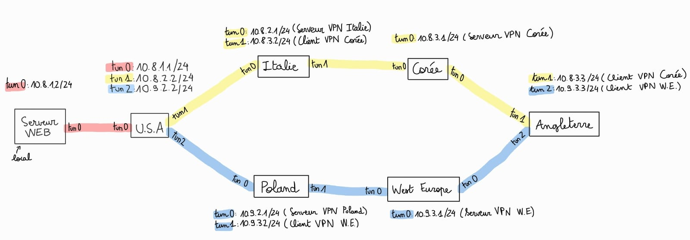

# 📡 Configuration du Routage et des Règles iptables

Ce guide détaille la configuration du routage et des règles `iptables` appliquées dans le projet pour assurer la connectivité entre les différents serveurs VPN et le bon acheminement des paquets.

---

## 🛠 Activation du Forwarding des Paquets

Avant de configurer `iptables` et les routes, il faut activer le forwarding IP pour permettre le passage des paquets entre interfaces :

```sh
echo "net.ipv4.ip_forward=1" | sudo tee -a /etc/sysctl.conf
sudo sysctl -p
```

Vérification :

```sh
cat /proc/sys/net/ipv4/ip_forward
```

La valeur `1` doit être affichée.

---

## 🌍 Configuration du Routage Dynamique

### 🔹 Schéma des routes utilisées durant le projet



### 📌 Ajout des routes sur **USA** :

Dans le projet, la machine **USA** dispose de deux chemins pour atteindre la machine **Angleterre** :

- Via **10.8.2.2/24** (**tun1**)

```sh
sudo ip route add 10.8.3.0/24 via 10.8.2.2 dev tun1
```

Cela ajoute une route statique sur la machine en indiquant comment atteindre le réseau 10.8.3.0/24 en passant par 10.8.2.2 via l'interface tun1.

- Via **10.9.2.2/24** (**tun2**)

```sh
sudo ip route add 10.9.3.0/24 via 10.9.2.2 dev tun2
```

De même ici, pour atteindre le réseau 10.9.3.0/24 on passe par 10.9.2.2 via tun2.

Ces routes permettent à la machine **USA** de relayer le trafic proprement.

---

## 🔥 Configuration des Règles `iptables`

### 🔹 Serveur **USA**

Autoriser le transfert des paquets entre les interfaces VPN :

```sh
sudo iptables -A FORWARD -i tun0 -o tun1 -j ACCEPT
sudo iptables -A FORWARD -i tun1 -o tun0 -j ACCEPT
sudo iptables -A FORWARD -i tun0 -o tun2 -j ACCEPT
sudo iptables -A FORWARD -i tun2 -o tun0 -j ACCEPT
```

Activer le NAT pour masquer l'adresse IP source :

```sh
sudo iptables -t nat -A POSTROUTING -o tun1 -j MASQUERADE
sudo iptables -t nat -A POSTROUTING -o tun2 -j MASQUERADE
```

---

### 🔹 Serveur **Italie**

```sh
sudo iptables -A FORWARD -i tun0 -o tun1 -j ACCEPT
sudo iptables -A FORWARD -i tun1 -o tun0 -j ACCEPT
sudo iptables -t nat -A POSTROUTING -o tun1 -j MASQUERADE
```

Même configurations pour le serveur **Poland**.

### 🔹 Serveur **Corée**

Redirection des paquets ICMP venant de l'Italie et visant la Corée, puis renvoyés vers la cible Angleterre :

```sh
sudo iptables -t nat -A PREROUTING -s 10.8.3.2 -d 10.8.3.1 -p icmp -j DNAT --to-destination 10.8.3.3
```

Pour le Serveur **West Europe** on aurait :

```sh
sudo iptables -t nat -A PREROUTING -s 10.9.3.2 -d 10.9.3.1 -p icmp -j DNAT --to-destination 10.9.3.3
```

Ensuite, il faut activer le NAT :

```sh
sudo iptables -t nat -A POSTROUTING -o tun0 -j MASQUERADE
```

---

## 🔄 Sauvegarde et Persistance des Règles

Pour rendre les règles `iptables` persistantes après redémarrage :

```sh
sudo apt install iptables-persistent
sudo netfilter-persistent save
sudo netfilter-persistent reload
```

Vérification des règles appliquées :

```sh
sudo iptables -L -v -n
sudo iptables -t nat -L -v -n
```

---

## 🔧 Dépannage

### ❌ Supprimer une règle précise

```sh
sudo iptables -D FORWARD -i tun0 -o tun1 -j ACCEPT
```

### 🔄 Réinitialiser toutes les règles `iptables`

```sh
sudo iptables -F
sudo iptables -t nat -F
```
