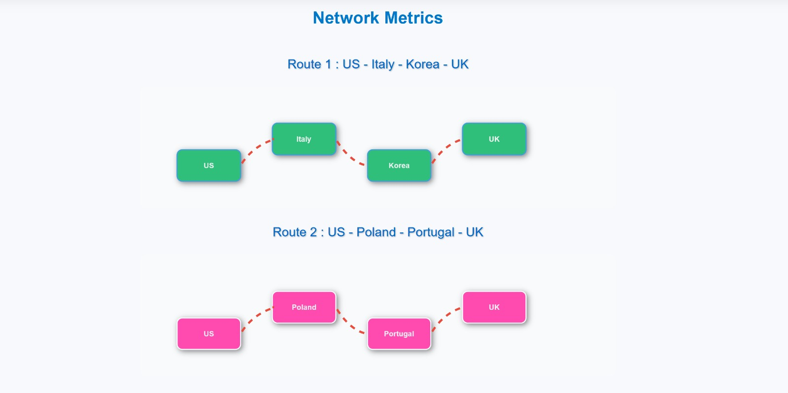
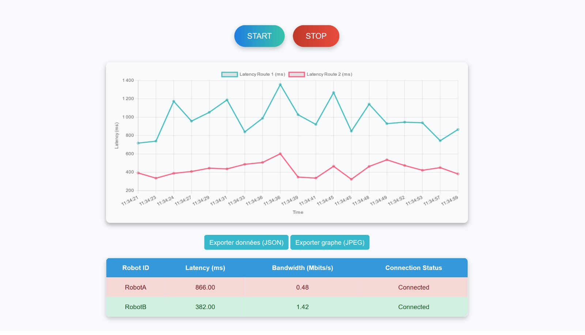

# Web Path Simulator (WPS)

## Description

Le **Web Path Simulator (WPS)** est un projet développé dans le cadre du **PING 53** (projet ingénieur - année 2024-2025) réalisé par un groupe de six étudiants dont moi-même. Il permet de simuler l’envoi de paquets à travers plusieurs routes réseau dans le monde et d'analyser leurs performances en temps réel.

L’objectif est d’observer la latence et la bande passante sur différentes routes composées de serveurs distants hébergés sur **Azure**. Les données sont ensuite comparées pour identifier le chemin optimal pour la transmission des paquets.

## Interface de l'application web :

### 🔹 Visualisation des chemins configurés



### 🔹 Monitoring des chemins



## Fonctionnalités

- 📡 **Envoi de paquets ICMP** via différentes routes.
- 🔍 **Monitoring en temps réel** des métriques réseau (latence, bande passante).
- 🔗 **Utilisation d’un VPN (OpenVPN)** pour relier plusieurs serveurs distants.
- 🌍 **Serveurs répartis dans différentes régions** (USA, Italie, Corée, Angleterre, Pologne, West Europe).
- 🌐 **Interface Web** pour visualiser et tester les différentes routes.

## Configuration mise en place

- **Serveur Web local** (VM sur VirtualBox) pour l’envoi des paquets.
- **Routage** entre plusieurs serveurs distants via OpenVPN.
- **Analyse des performances réseau** avec `ping`, `iperf` et `tcpdump`.

## Prérequis

Avant de commencer, assure-toi d'avoir :

- 🔹 Des connaissances en **routage réseau** (`iptables`, `ip route`).
- 🔹 Une compréhension des **VPN et tunnels** (`OpenVPN`).
- 🔹 Des outils de mesure réseau installés (`ping`, `traceroute`, `iperf`).
- 🔹 Un environnement de développement web.

## Installation

1. **Cloner le projet** :

   ```sh
   git clone https://github.com/Reeperc/Web-Path-Simulator/web-site

   ```

## 🚀 Contributeurs

<table>
  <tr>
    <td align="center"><a href="https://github.com/Reeperc"><br /><sub><b>@Reeperc</b></sub></a></td>
    <!-- <td align="center"><a href="https://github.com/pseudo1"><br /><sub><b>@pseudo1</b></sub></a></td>
    <td align="center"><a href="https://github.com/pseudo2"><br /><sub><b>@pseudo2</b></sub></a></td>
    <td align="center"><a href="https://github.com/pseudo3"><br /><sub><b>@pseudo3</b></sub></a></td> -->
  </tr>
</table>
